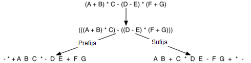

\newpage

# Indice

1. Introduccion.
2. Descripcion del problema.
3. Descripción del paradigma.
4. Análisis del problema.
5. Aspectos de la implementación.
6. concluisiones.
7. Referencias.

\newpage 
# Introducción

Los paradigmas de programación son marcos de trabajo para, desde cierta perspectiva abordada según el problema a solucionar,  trabajar con herramientas ya establecidas según las normas que lo rigen en el cotexto dado.
Es preciso señalar que indiferente de los lenguajes nuevos, modernos y sus herramnientas propias asociadas, siempre se regirán por al menos uno o más paradigmas de programación. Pues son estos quienes nos permiten analizar de buena manera la mejor respuesta a un problema y su contexto especifico.

### Objectivo General

Para este el caso de este laboratorio, se plantea la construcción de una pieza de software pequeña que permita emular un controlador de versiones tipo GIT, dentro de los parametros del paradigma de programacion funcional y sus visitudes.

### Objectivos Específicos

Para abordar el problema se plantean lo siguientes objectivos especificos

* Análisis del problema 
* Aspectos de implementación
* construccion de implementacion 
* Conclusiones

Este informe solo recopila el estudio y construccion del proyecto de laboratorio descrito, por lo que no se abordarán otros paradigmas que pueden mencionarse como referencia para la construcción del mismo en las páginas contiguas. 

\newpage
# Descripción Del Problema

Uno de los problemas más comunes al momento de trabajar en conjunto con otras personas dentro de un mismo proyecto que involucre el desarrollo de software, es el seguimiento de cambios sobre el mismo sobre el código fuente del mismo, puesto que un cambio dentro del código fuente de una pieza de software, puede tener un impacto importante al momento de ser utilizado por el usuario final.

Los problemas más comunes que se desprenden de esta problematica son los siguientes:

- Cambios no supervisados
- errores en cambios no supervisados
- manejo de errores en versiones funcionales del proyecto
- manejo de nuevas funcionalidades en versiones futuras del proyecto
- registro de cambios realizados, quién los hizo , cuándo los hizo y qué hizo
- estaciones de trabajo independientes para no cruzar cambios de distintos colaboradores
- versionado de proyecto para su despligue

Es por lo anterior mencionado que nacen los "controladores de versiones", software encargado de solucionar todos los estados del problema anterior mencionado, ayudando al al monitoreo, control y desarrollo del proyecto en cuestión más eficiente.

\newpage
# Descripción Del Paradigma

El paradigma funcional en cuestión es el empleado para el desarrollo del laboratorio abordado en este informe y su desarrollo dentro del lenguaje empleado para el codigo fuente.

Este paradigma de caracter declarativo, forja y construye el mundo a partir de su unidad minima, la función. Cualquier elemento o representación en cuestión se hace a partir de las funciones. El uso de la función está ligado inherentemente a las funciones matemáticas y cómo estas se expresan. Es decir, tenemos un dominio y un recorrido para cada función que creamos es este tipo de paradigmas.

Una de las caracteristicas más importante a mencionar es el uso de calculo lambda, un sistema formal, de uso matemático para la implementación y el estudio de funciones. esta emplea una notación prefija, es decir una notacion donde los operadores se encuentran antes que los operandos al momento de su definición 

{#id .class width=50% height=50%}

Otra caracteristica importante dentro de este paradigma de programacion es el uso de la recursividad como recurso para la resolución de problemas. La recursión es un método de resolución de problemas donde la solución al problema inicial son instancias de más pequeñas del mismo problema, por lo tanto podemos decir que la recursión se define en terminos de si misma.

{#id .class width=50% height=50% center=left}

\newpage
# Análisis del problema

Desde el punto de vista tecnológico, un controlador de versiones tiene muchas virtudes, pues no solo nos permite controlar los cambios dentro de un proyecto en transcurso, sino que nos permite desplegar versiones distintas y modularizar.

El uso de sectores de trabajo permite modularizar de mejor manera el trabajo realizado y por lo tanto es perentorio utilizar estos para así satisfacer las necesidades generales del trabajo en cuestión.

En este caso se cuentan con 4 estaciones o zonas de trabajo, las cuales son las siguientes:

  * LocalRepository : Repositorio Local donde se guardan los cambios realizados de manera local
  * Index: Sector donde los cambios no guardados quedan de manera transitoria antes de ser entregados
  * rama: zona de trabajo donde se ordenan los cambios realizados a través del tiempo.
  * Remote Repository: Zona de trabajo remoto donde guardamos los cambios de manera externa para que otros puedan acceder a estos
  
La unidad básica dentro de estas estaciones de trabajo es el "commit". Esta mantiene la información pertinente al proyecto guardada y a su vez metainformacion referente a la persona que hizo el cambio, cuando lo hizo y que archivos tocó para poder hacerlo, y a su vez, el commit depende de otra unidad dentro de esta la cual es el arhivo, que son los documentos que el grupo de desarrollo trabaja dentro del tiempo.

Otro Concepto importante son las "ramas", más allá de lo ya dicho, poder trabajar con más de una rama permite al usuario final poder diversificar desarrollo del proyecto sin comprometer el trabajo realizado por otros colaboradores dentro del mismo. La construcción de ramas provenientes de otras ramas permite también crear features o bugfix de manera más eficiente.

\newpage
# Aspectos de la implementación

Para la implementacion se han considerado los siguientes TDA, estos nos ayudarán de mejor manera a entender el flujo de trabajo correspondiente:

* Archivo : TDA que representa un archivo dentro de nuestra zona de trabajo.
  - tipo: (lista nombre contenido)
  - constructor: Archivo
  - accesores: getNombreArchivo, getContenidoArchivo
  - selectores: isArchivo
  - pertenencia: setContenido setNombre
  - otras funciones: archivo2String

* Commit: TDA que representa un commit dentro de nuestras zonas de trabajo, con su respectiva lista de archivos y un comentario asociado

  - tipo : (lista nombreCommit (lista Archivos))
  - constructor: Commit
  - accesores: getMensajeCommit getArchivosCommit
  - pertenencia: isCommit
  - otras funciones: commit2String
  
  
  
* WorkingZone: TDA que tiene como funcion la representacion de aquellas zonas de trabajo que solo llevan archivos (workSpace e Index)

  - tipo: (lista Archivos)
  - constructor: WorkingZone
  - accessor: getArchivos
  - pertenencia: isWorkingZone
  - otras funciones: work2String

* RepoZone: TDA que tiene como funcion la representacion de aquellas zonas que llevan commits (LocalRepository y RemoteRepository)

  - tipo: (lista Commits)
  - constructor: RepoZone
  - accesores: getCommits
  - pertenencia: isRepoZone
  - selectores: agregarCommit
  - otras funciones: repo2String

\newpage
* Repository: TDA que tiene como funcion la representacion final del flujo completo de git, con todas sus funcionalidades correspondientes

  - tipo: (lista WorkingZone(Workspace) WorkingZone(index) RepoZone(LocalRepository) RepoZone(RemoteRepository))
  - constructor: Repository
  - accesor: getWorkSpace, getIndex, getLocal, getRemote
  - other functions: git, add, commit, push, pull, git->String, proccessPull
  
Para efectos de documentacion asociados a los elementos abstractos de TDA (constructor, accesor, pertenencia, selectores y otras funciones), por cada archivo de TDA se ha documentado cada funcion asociada a este, agregando el nombre de la funcion, la descripcion, dominio y recorrido de la funcion, recursividad asociada a la funcion si es que se ocupa y motivo de la recursion asociada si es que se ocupa.

\newpage
# Conclusiones 

La programación funcional nos otorga una mirada distinta al resolver problemas, no solo desde el punto de vista de la programación, si no que desde el punto de vista matemático. La representación de elementos como funciones permite la solución de problemas a partir de modelos más simples y su abstracción permite sustraer aspectos que no son necesarios considerar cuando se describe un problema y que si bien son parte de ellos, no afectan en lo absoluto la representación final.

En aspectos practicos "el paradigma funcional" nos permite ordenar y hacer de nuestra representación una solución más elegante. La implementación de funciones lambda permite no solo modularizar y simplificar, sino que también nos deja ordenar de mejor manera las entradas y salidas de cada funcion, haciendo que no tengamos que escribir código innecesario o redundante.

El uso inteligente de la recursión como método de solución para con los problemas entregados también nos permite complementar lo anterior dicho, pues. Permite definir la solución de problemas en torno a definiciones más pequeñas de si mismo, eliminando codigo innecesario, permitiendo ejecución inteligente de código y haciendo que la compresión de este no sea compleja para el usuario.

\newpage
# Referencias 

Para el desarrollo de este laboratorio se han ocupado las siguientes referencias:
  
  * libro : "A short introduction to the Lambda Calculus" , Achim Jung. March 18, 2004.
  * libro : "Programing with abstract data types" , Barbara Liskov. Massachusetts Institute of Technology.
  * web   : "documentacion Scheme GNU ORG", https://www.gnu.org/software/mit-scheme/documentation/mit-scheme-user/Introduction.html. 

